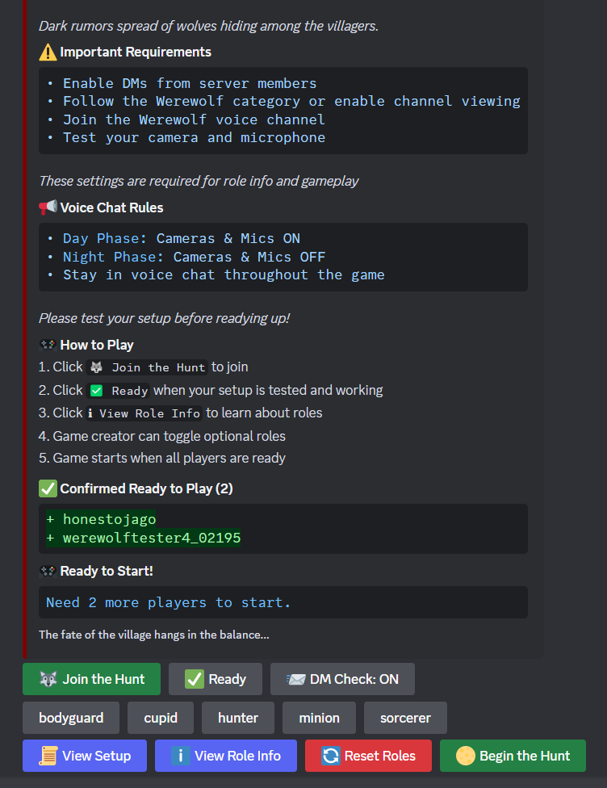

# Discord Werewolf Bot 🐺 (Early Development)

Welcome to the **Discord Werewolf Bot** 🐺—your gateway to the thrilling social deduction game of Werewolf (also known as Mafia) right within your Discord server! With seamless video and voice chat integration, gather your friends, form alliances, and unveil the hidden werewolves among you.

## 🌟 Why Choose Discord Werewolf Bot?

Embark on an immersive gaming experience where strategy, deception, and deduction come alive. Whether you're a seasoned Werewolf veteran or new to the game, our bot offers an intuitive and engaging platform to enjoy endless rounds of intrigue and fun.

## 🎮 Gameplay Overview

Dive into the classic game of Werewolf with enhanced features that make each session unique and exciting:

### 🔄 **Game Flow**

1. **Setup Phase**
   - **Start a Game**: Server admin uses `/create` to initiate a new game session.
   - **Join the Game**: Players join using the **Join** button or the `/join` command.
   - **Configure Roles**: Toggle optional roles like Bodyguard, Cupid, and Hunter to customize your game.
   - **Begin the Hunt**: Once ready, start the game with a minimum of 4 players.

2. **Night Zero Phase**
   - **Silent Beginnings**: All players turn off cameras and microphones.
   - **Secret Actions**:
     - **Seer**: Receives the name of a random non-werewolf player.
     - **Cupid**: If active, chooses two players to become lovers.
   - **Automatic Transition**: After all mandatory actions are completed (or after a timeout if necessary), the game progresses to the Day phase.

3. **Night Phase**
   - **Dark Deeds**: All players turn off cameras and microphones.
   - **Secret Actions**:
     - **Werewolves** communicate in a private text channel to identify and attack a villager.
     - **Seer** investigates a player's role.
     - **Bodyguard** protects a player from attacks.
     - **Cupid** pairs two players as lovers.
     - **Hunter** preps for a final revenge shot.
   - **Action Commands**: Players submit their actions via DMs to the bot, which prompts them through private messages when actions are required.

4. **Day Phase**
   - **Reveal and React**: Cameras and microphones are turned back on.
   - **Discussion and Debate**: Players discuss, accuse, and defend.
   - **Voting Time**: Nominate and vote to eliminate a suspected werewolf.

5. **Winning the Game**
   - **Villagers Win**: All werewolves are eliminated.
   - **Werewolves Win**: Werewolves equal or outnumber the villagers.

### 🧑‍🤝‍🧑 **Roles Explained**

- **🐺 Werewolves**: Covertly eliminate villagers at night. They communicate with each other in a private text channel within the Discord server to strategize and plan their attacks.
- **👁️ Seer**: Discover the true identity of players.
- **🛡️ Bodyguard**: Shield players from werewolf attacks.
- **💘 Cupid**: Create bonds that affect the game's outcome.
- **🏹 Hunter**: Execute a final revenge upon elimination.
- **👥 Villagers**: Work together to root out werewolves.

## 🚀 Getting Started

Ready to play? Follow these simple steps to set up the Discord Werewolf Bot on your server!

### 📋 Prerequisites

- **Node.js**: Version 16.9.0 or higher.
- **Discord Bot Token**: Obtain from the [Discord Developer Portal](https://discord.com/developers/applications).
- **Discord Server**: With administrator privileges to manage bot permissions.
- **Git**: For cloning the repository.

### 💻 Installation

1. **Clone the Repository**
   ```bash
   git clone https://github.com/HonestoJago/Discord-Werewolf-Bot.git
   ```
2. **Navigate to the Project Directory**
   ```bash
   cd discord-werewolf-bot
   ```
3. **Install Dependencies**
   ```bash
   npm install
   ```
4. **Configure Environment Variables**
   - Create a `.env` file in the root directory:
     ```env
     BOT_TOKEN=your_discord_bot_token
     CLIENT_ID=your_client_id
     ALLOWED_CHANNEL_IDS=comma,separated,channel,ids
     WEREWOLF_CATEGORY_ID=category_for_private_channels
     ```
   - **Parameters**:
     - `BOT_TOKEN`: Your Discord bot token.
     - `CLIENT_ID`: The client ID from the Discord Developer Portal.
     - `ALLOWED_CHANNEL_IDS`: (Optional) Channels where the bot can operate.
     - `WEREWOLF_CATEGORY_ID`: The category ID for private channels like Werewolf and Dead Players.

5. **Start the Bot**
   ```bash
   node bot.js
   ```

### 📑 Setting Up Discord Permissions

To ensure the bot functions correctly, assign it the following permissions when adding it to your server:

- **Manage Channels**: To create and delete private channels.
- **Send Messages**: To communicate game updates and prompts.
- **Manage Messages**: To handle user interactions effectively.
- **Embed Links**: For rich and interactive game messages.
- **Read Message History**: To keep track of game progress.
- **Use External Emojis**: To enhance the game's visual appeal.

You can generate an invite link with these permissions using the OAuth2 URL generator in the Discord Developer Portal.

## ⚙️ Available Commands

Enhance your gaming experience with a variety of commands:

### 🎲 Game Management
- `/create` - Start a new game session.
- `/join` - Enter an active game.
- `/end-game` - Terminate the current game.
- `/game-status` - View the current game state.

### 🎭 Player Actions
- `/action` - Submit your night actions (use in DMs).
  - `attack` (Werewolf)
  - `investigate` (Seer)
  - `protect` (Bodyguard)
  - `choose_lovers` (Cupid)
  - `choose_target` (Hunter)

### 📊 Player Statistics
- `/stats` - View your game statistics.

### 📜 Role Information
- `/role-info` - Get detailed information about each role.

## 🛠 Technical Architecture

Our bot is built with scalability and maintainability in mind. Here's a peek under the hood:

### 🔧 Core Components
- **WerewolfGame.js**: Manages game state and logic.
- **NightActionProcessor.js**: Handles night-phase actions.
- **Player.js**: Manages individual player states.
- **VoteProcessor.js**: Oversees the voting system.
- **Handlers**:
  - `dayPhaseHandler.js`: Manages day-phase activities.
  - `buttonHandler.js`: Handles interactive button events.
- **Utilities**:
  - `embedCreator.js`: Crafts rich embed messages.
  - `buttonCreator.js`: Generates interactive buttons.

### 📈 Features
- **Dynamic Role Assignment**: Customize roles for varied gameplay.
- **Private Channels**: Secure discussions for werewolves and dead players.
- **State Persistence**: Ensure game continuity even after interruptions.
- **Comprehensive Logging**: Keep track of game events and errors.
- **Modular Design**: Easily extendable for future features.

## 🤝 Contributing

We love community contributions! Follow these steps to become a part of the Werewolf Bot development:

1. **Fork the Repository**
2. **Create a Feature Branch**
   ```bash
   git checkout -b feature/NewFeature
   ```
3. **Commit Your Changes**
   ```bash
   git commit -m 'Add NewFeature'
   ```
4. **Push to Your Branch**
   ```bash
   git push origin feature/NewFeature
   ```
5. **Open a Pull Request**

## 📜 License

This project is licensed under the MIT License. See the [LICENSE](LICENSE) file for details.

## 🌐 Support & Community

Join our thriving community and get the support you need:

- **Issues**: Report bugs via the [Issue Tracker](https://github.com/HonestoJago/Discord-Werewolf-Bot/issues).
- **Discussion**: Engage with other players and developers in [Discussions](https://github.com/HonestoJago/Discord-Werewolf-Bot/discussions).
- **Discord Server**: Connect me for a private invite to the Discord server.

## 🌟 Acknowledgments

- Built with [Discord.js](https://discord.js.org/).
- Inspired by the timeless Werewolf/Mafia party game.
- Special thanks to Claude 3.5 Sonnet and o1-mini for assisting with this project!

## 📸 Screenshots

*Note: The images are a bit dated, and the GUI and embedded messages are continually improving to enhance your gaming experience.*

### 🎉 Game Setup

*Initial game setup and role configuration interface.*

### ☀️ Day Phase

*Players discussing strategies during the day.*

### 🌙 Night Actions

*Werewolves coordinate their sinister plans in DMs.*

## 🎉 Game End

At the conclusion of each game, all private channels (e.g., Werewolf and Dead Players channels) are automatically cleaned up and deleted to maintain server organization. This process is managed using the `WEREWOLF_CATEGORY_ID` specified in the environment variables.

---

Made with ❤️ by Jonathan Frodella
