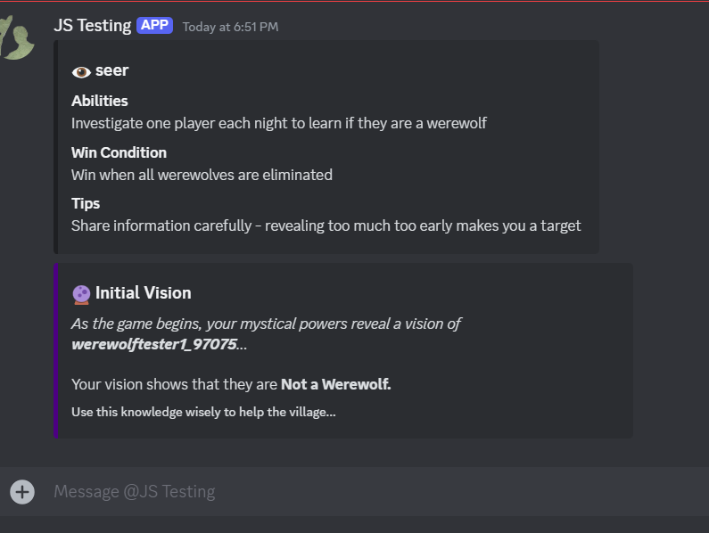

# Discord Werewolf Bot 🐺 (Early Development)

Welcome to the **Discord Werewolf Bot** 🐺—your gateway to the thrilling social deduction game of Werewolf (also known as Mafia) right within your Discord server! With seamless video and voice chat integration, gather your friends, form alliances, and unveil the hidden werewolves among you.

## 🎮 Gameplay Overview

Dive into the classic game of Werewolf with enhanced features that make each session unique and exciting:

### 🔄 **Game Flow**

1. **Setup/Lobby Phase**
   - **Start a Game**: Server admin initiates with the Create button (or `/create` as backup)
   - **Join the Game**: Players join using the **Join** button (or `/join` as backup)
   - **Configure Roles**: Use intuitive toggle buttons to customize optional roles
   - **Role Preview**: View current role distribution with the **View Roles** button
   - **Begin the Hunt**: Start the game when ready (minimum 4 players)

2. **Night Zero Phase**
   - **Silent Beginnings**: All players turn off cameras and microphones
   - **Special Role Actions**:
     - **Seer**: Receives initial vision via DM about a random non-werewolf player
     - **Cupid**: If active, uses dropdown menu to choose their own lover (if either lover dies, both die of heartbreak)
   - **Automatic Transition**: Game advances to first Day phase after all actions complete

3. **Day Phase**
   - **Discussion Time**: All players turn cameras and microphones back on
   - **Enhanced Voting System** (all through intuitive dropdown menus and buttons):
     - **Nomination**: Select players through dropdown menu
     - **Seconding**: Support nominations with clear button interface
     - **Voting**: Cast votes through guilty/innocent buttons
   - **Visual Feedback**: 
     - Real-time vote tallies
     - Clear nomination status indicators
     - Detailed voting results in embedded messages

4. **Night Phase**
   - **Dark Deeds**: All players turn off cameras and microphones
   - **Role Actions** (all through convenient dropdown menus in DMs):
     - **Werewolves**: Select victims in their private channel
     - **Seer**: Choose investigation targets
     - **Bodyguard**: Select protection targets
     - **Hunter**: Choose revenge target (when eliminated)
   - **Real-time Feedback**: Immediate confirmation of submitted actions

The game alternates between Day and Night phases until a win condition is met:
- **Villagers Win**: All werewolves are eliminated
- **Werewolves Win**: Werewolves equal or outnumber the villagers

### 🎮 Interface Priority
All game actions are primarily conducted through our intuitive GUI system:
- **Dropdown Menus**: For player selection and actions
- **Interactive Buttons**: For voting and role toggles
- **Rich Embeds**: For game information and results

Slash commands are maintained only as a backup system and are not the primary way to interact with the game.

### 🧑‍🤝‍🧑 **Roles Explained**

- **🐺 Werewolves**: Covertly eliminate villagers at night. They communicate with each other in a private text channel within the Discord server to strategize and plan their attacks.
- **👁️ Seer**: Discover the true identity of players.
- **🛡️ Bodyguard**: Shield players from werewolf attacks.
- **💘 Cupid**: Chooses one player as their lover at the start of the game. The two lovers' fates are intertwined - if either dies, the other dies of heartbreak.
- **🏹 Hunter**: Execute a final revenge upon elimination.
- **👥 Villagers**: Work together to root out werewolves.
- **🦹 Minion**: A devoted servant who knows the werewolves but remains unknown to them. Has no active powers but wins with the wolves. Must help the werewolves while maintaining their cover.
- **🧙 Sorcerer**: A mystical ally who investigates one player each night to determine if they are the Seer. Wins with the werewolves but remains unknown to them. Must use their knowledge to help eliminate the Seer while avoiding detection.

## ⌨️ Commands & Interface

The bot primarily uses an intuitive GUI-based interface with buttons and dropdown menus for most actions. Slash commands are maintained as a backup system:

### 🎮 Primary Interface
- **Buttons**: Join game, toggle roles, view setup, start game
- **Dropdowns**: Player selection, night actions, nominations
- **Interactive Embeds**: Game status, voting results, role information

## 🚀 Getting Started

Ready to play? Follow these simple steps to set up the Discord Werewolf Bot on your server!

### 📋 Prerequisites

- **Node.js**: Version 16.9.0 or higher.
- **Discord Bot Token**: Obtain from the [Discord Developer Portal](https://discord.com/developers/applications).
- **Discord Server**: With administrator privileges to manage bot permissions.
- **Git**: For cloning the repository.

### 🔔 Player Requirements

For the best gameplay experience, players must:
- **Enable DMs**: Allow direct messages from server members in Discord privacy settings
- **Channel Access**: Either:
  - Follow the Werewolf category (recommended), or
  - Have "View Channel" permissions for all channels
  
These settings are crucial as:
- The bot sends role information and night actions via DM
- Players need access to private channels (werewolf chat, dead player chat) when applicable
- Missing these settings can disrupt gameplay and may prevent participation

### 💻 Installation

1. **Clone the Repository**
   ```bash
   git clone https://github.com/HonestoJago/Discord-Werewolf-Bot.git
   ```
2. **Navigate to the Project Directory**
   ```bash
   cd discord-werewolf-bot
   ```
3. **Install Dependencies**
   ```bash
   npm install
   ```
4. **Configure Environment Variables**
   - Create a `.env` file in the root directory:
     ```env
     BOT_TOKEN=your_discord_bot_token
     CLIENT_ID=your_client_id
     ALLOWED_CHANNEL_IDS=comma,separated,channel,ids
     WEREWOLF_CATEGORY_ID=category_for_private_channels
     ```
   - **Parameters**:
     - `BOT_TOKEN`: Your Discord bot token.
     - `CLIENT_ID`: The client ID from the Discord Developer Portal.
     - `ALLOWED_CHANNEL_IDS`: (Optional) Channels where the bot can operate.
     - `WEREWOLF_CATEGORY_ID`: The category ID for private channels like Werewolf and Dead Players.

5. **Start the Bot**
   ```bash
   node bot.js
   ```

### 📑 Setting Up Discord Permissions

To ensure the bot functions correctly, assign it the following permissions when adding it to your server:

- **Manage Channels**: To create and delete private channels.
- **Send Messages**: To communicate game updates and prompts.
- **Manage Messages**: To handle user interactions effectively.
- **Embed Links**: For rich and interactive game messages.
- **Read Message History**: To keep track of game progress.
- **Use External Emojis**: To enhance the game's visual appeal.

You can generate an invite link with these permissions using the OAuth2 URL generator in the Discord Developer Portal.

## ⚙️ Available Commands

Enhance your gaming experience with a variety of commands:

### 🎲 Game Management
- `/create` - Start a new game session.
- `/join` - Enter an active game (or use the Join button in the lobby).
- `/end-game` - Terminate the current game.
- `/game-status` - View the current game state.

### 📊 Player Statistics
- `/stats` - View your game statistics.

### 📜 Role Information
- `/role-info` - Get detailed information about each role.

## 🛠 Technical Architecture

Our bot is built with scalability and maintainability in mind. Here's a peek under the hood:

### 🔧 Core Components
- **WerewolfGame.js**: Manages game state and logic.
- **NightActionProcessor.js**: Handles night-phase actions.
- **Player.js**: Manages individual player states.
- **VoteProcessor.js**: Oversees the voting system.
- **Handlers**:
  - `dayPhaseHandler.js`: Manages day-phase activities.
  - `buttonHandler.js`: Handles interactive button events.
- **Utilities**:
  - `embedCreator.js`: Crafts rich embed messages.
  - `buttonCreator.js`: Generates interactive buttons.

### 📈 Features
- **Dynamic Role Assignment**: Customize roles for varied gameplay.
- **Private Channels**: Secure discussions for werewolves and dead players.
- **State Persistence**: Ensure game continuity even after interruptions.
- **Comprehensive Logging**: Keep track of game events and errors.
- **Modular Design**: Easily extendable for future features.

## 🤝 Contributing

We love community contributions! Follow these steps to become a part of the Werewolf Bot development:

1. **Fork the Repository**
2. **Create a Feature Branch**
   ```bash
   git checkout -b feature/NewFeature
   ```
3. **Commit Your Changes**
   ```bash
   git commit -m 'Add NewFeature'
   ```
4. **Push to Your Branch**
   ```bash
   git push origin feature/NewFeature
   ```
5. **Open a Pull Request**

## 📜 License

This project is licensed under the MIT License. See the [LICENSE](LICENSE) file for details.

## 🌐 Support & Community

Join our thriving community and get the support you need:

- **Issues**: Report bugs via the [Issue Tracker](https://github.com/HonestoJago/Discord-Werewolf-Bot/issues).
- **Discussion**: Engage with other players and developers in [Discussions](https://github.com/HonestoJago/Discord-Werewolf-Bot/discussions).
- **Discord Server**: Connect me for a private invite to the Discord server.

## 🌟 Acknowledgments

- Built with [Discord.js](https://discord.js.org/).
- Inspired by the timeless Werewolf/Mafia party game.
- Special thanks to Claude 3.5 Sonnet and o1-mini for assisting with this project!

## 📸 Screenshots

### 🎮 Game Setup

*Initial game setup screen with role configuration options and join button*

### 🌙 Night Zero Actions

*Cupid selecting lovers during Night Zero phase*

### ☀️ Day Phase

*Day phase discussion and nomination interface*

### ⚔️ Day Phase Combat

*Players discussing and debating during the day*

### 💀 Dead Chat

*Private channel for eliminated players to discuss the game*

### 💘 Love Stories

*Cupid's love connection notification*


*The tragic consequence when one lover dies*

### 🐺 Werewolf Actions

*Secret werewolf coordination channel*


*Werewolf target selection via DM*

### 🔮 Seer Powers

*Seer's investigation interface*

### ⚖️ Voting System

*Nomination seconding interface*


*Final voting interface for player elimination*


*Detailed voting results display*

### 📊 Player Information

*Detailed player statistics tracking*

### 🏆 Victory

*Victory screen showing game results*

## 🎉 Game End

At the conclusion of each game, all private channels (e.g., Werewolf and Dead Players channels) are automatically cleaned up and deleted to maintain server organization. This process is managed using the `WEREWOLF_CATEGORY_ID` specified in the environment variables.

## 🚀 Upcoming Features

We're actively developing new features to enhance your gaming experience:

### 🎭 New Roles
- **🔮 Sorcerer**: A cunning ally of the wolves who:
  - Seeks to identify the Seer through nightly investigations
  - Wins with the werewolves but remains unknown to them
  - Receives "Seer" or "Not Seer" results from investigations
  - Does not count as a werewolf for win conditions
- **👹 Minion**: A devoted servant of the wolves who:
  - Knows the werewolves' identities from the start
  - Remains unknown to the werewolves themselves
  - Has no active powers but wins with the wolves
  - Does not count as a werewolf for win conditions
- More roles planned based on community feedback!

### 📊 Enhanced Statistics
- **Global Leaderboards**: Compare stats across all servers
- **Role-specific Rankings**: Best werewolf, most successful seer, etc.
- **Achievement System**: Unlock special badges and titles

### 💾 Persistent Gaming
- **Database Integration**: 
  - SQLite database for reliable storage
  - Automatic game state snapshots
  - Player statistics tracking
  - Role history and achievements
- **Game State Recovery**: 
  - Seamless recovery after interruptions
  - Preserves all game progress
  - Maintains channel states
  - Restores player roles and actions
- **Long-term Statistics**: 
  - Individual player tracking
  - Role-specific performance
  - Win rates and streaks
  - Historical game data
- **Cross-server Profiles**: 
  - Unified player statistics
  - Achievement progression
  - Consistent tracking across servers

---

Made with ❤️ by Jonathan Frodella
