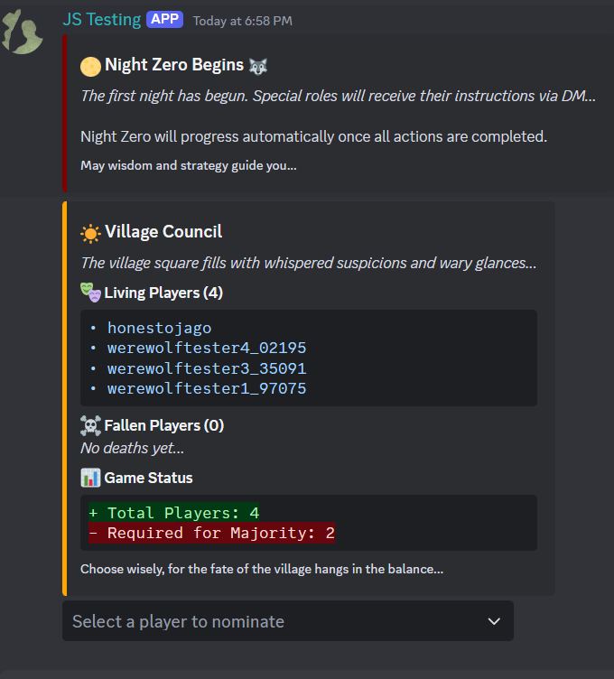
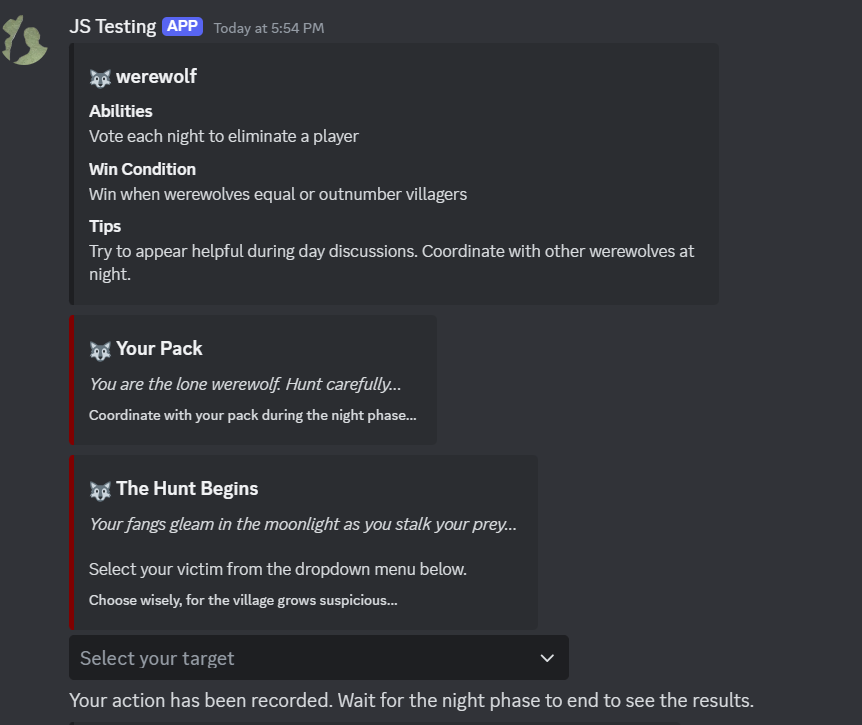
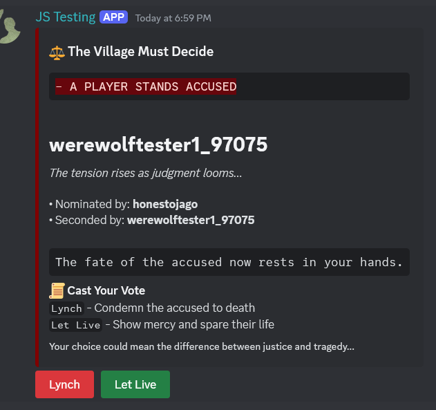

# Discord Werewolf Bot 🐺 (Early Development)

A Discord bot that brings the classic social deduction game Werewolf (Mafia) to life with video and voice chat integration. This project is currently in early development, with plans to add more roles, features, and gameplay mechanics in future updates.

## 🚧 Development Status

This bot is currently in active development. While core gameplay mechanics are functional, you may encounter bugs or incomplete features. We welcome contributions and feedback to help improve the project.

### Planned Features
- Additional roles (Witch, Mason, Fool, etc.)
- Custom game settings (day/night duration, role combinations)
- Game statistics and player rankings
- Multiple language support
- Web dashboard for server configuration
- Advanced moderation tools

## ✨ Current Features

### 🎮 Gameplay Integration
- **Video/Voice Management**: Automated control of player video/audio based on game phase
- **Private Channels**: Secure communication for special roles and spectators
- **Direct Messaging**: Private role assignments and night action coordination
- **Interactive UI**: Button-based controls and rich embeds for intuitive gameplay

### 🎭 Current Role System

#### Core Roles
- 🐺 **Werewolves** (1 per 4 players)
  - Form a minority team trying to eliminate villagers
  - Vote each night to eliminate one player
  - Win when they equal or outnumber villagers

- 👁️ **Seer** (Always 1)
  - Investigates one player each night
  - Learns if the investigated player is a werewolf
  - Must balance sharing information with staying alive

- 👥 **Villagers** (Remaining players)
  - Must deduce and eliminate werewolves through discussion
  - Vote during the day to eliminate suspicious players
  - Win when all werewolves are eliminated

#### Optional Roles
- 🛡️ **Bodyguard**
  - Protects one player each night from werewolf attacks
  - Cannot protect the same player twice in a row
  - Must strategically choose protection targets

- 💘 **Cupid**
  - Chooses two players to be lovers at the start
  - If one lover dies, the other dies of heartbreak
  - Creates interesting strategic dynamics

- 🏹 **Hunter**
  - When eliminated, can take one other player with them
  - Powerful revenge ability that can turn the tide
  - Must choose target carefully

## 🎮 Detailed Game Flow

### Setup Phase
1. Server admin uses `/create` to start a new game session
2. Players join using the Join button or `/join` command
3. Game creator can:
   - Toggle optional roles (Bodyguard, Cupid, Hunter)
   - View current player list and role distribution
   - Start the game when ready (minimum 4 players)

### Night Zero (First Night)
1. All players receive their roles via DM
2. Special role actions occur:
   - Werewolves learn their teammates
   - Seer receives first investigation
   - Cupid (if present) chooses lovers
3. Players should disable cameras/mics

### Day Phase
1. All players enable cameras and microphones
2. Discussion period begins
3. Players can:
   - Nominate suspects for elimination
   - Second others' nominations
   - Vote on eliminations
4. Voting System:
   - Nominations need a second to proceed to voting
   - All living players except the accused can vote
   - Majority needed for elimination

### Night Phase
1. All players disable cameras and microphones
2. Role-specific actions occur in order:
   - Seer investigates a player
   - Bodyguard protects a player
   - Werewolves vote to eliminate a player
3. Results are revealed at dawn

## 🚀 Detailed Installation Guide

### Prerequisites
- Node.js 16.9.0 or higher
- Discord Bot Token (from Discord Developer Portal)
- Discord Server with admin privileges
- Git (for cloning repository)

### Environment Variables
Create a `.env` file in the root directory with the following:

BOT_TOKEN=your_discord_bot_token
CLIENT_ID=your_client_id
ALLOWED_CHANNEL_IDS=comma,separated,channel,ids
WEREWOLF_CATEGORY_ID=category_for_private_channels

### Installation Steps

# Clone repository
git clone https://github.com/jfrodella/discord-werewolf-bot.git

# Install dependencies
npm install

# Start the bot
node bot.js

## 🎯 Commands

### Game Management
- `/create` - Start new game session
- `/join` - Enter active game
- `/end-game` - End current game
- `/game-status` - View game state

### Player Actions
- `/action` - Submit night actions (DM only)
  - `attack` (Werewolf)
  - `investigate` (Seer)
  - `protect` (Bodyguard)
  - `choose_lovers` (Cupid)
  - `choose_target` (Hunter)

## 🛠 Technical Architecture

### Core Components
- `WerewolfGame.js` - Game state & logic
- `NightActionProcessor.js` - Night phase handling
- `Player.js` - Player state management
- `VoteProcessor.js` - Voting system
- `buttonHandler.js` - UI interactions
- `embedCreator.js` - Message formatting

### Features
- Comprehensive error handling with `GameError` class
- Extensive logging system
- State persistence
- Modular design

## 🧪 Development

### Contributing
1. Fork repository
2. Create feature branch (`git checkout -b feature/NewFeature`)
3. Commit changes (`git commit -m 'Add NewFeature'`)
4. Push to branch (`git push origin feature/NewFeature`)
5. Open Pull Request

## 📜 License

This project is licensed under the MIT License - see the [LICENSE](LICENSE) file for details.

## 🤝 Support & Community

- **Issues**: Report bugs via [Issue Tracker](https://github.com/jfrodella/discord-werewolf-bot/issues)
- **Questions**: Ask in [Discussions](https://github.com/jfrodella/discord-werewolf-bot/discussions)
- **Discord**: Reach out for information regarding our Discord server

## 🌟 Acknowledgments

- Built with [Discord.js](https://discord.js.org/)
- Inspired by the classic Werewolf/Mafia party game
- Documentation crafted with assistance from Claude AI
- Thanks to all contributors

## 📸 Screenshots

### Game Setup

*Initial game setup and role configuration interface*

### Day Phase

*Players discussing during the day phase*

*Results of night actions revealed during day*

### Night Actions

*Werewolves receive their role and instructions*

*Seer receiving their investigation results*

### Voting System

*Players seconding nominations for elimination*

*Final voting interface for player elimination*

### Private Channels

*Private channel for werewolves to coordinate*

*Spectator channel for eliminated players*

---
Made with ❤️ by Jonathan Frodella
